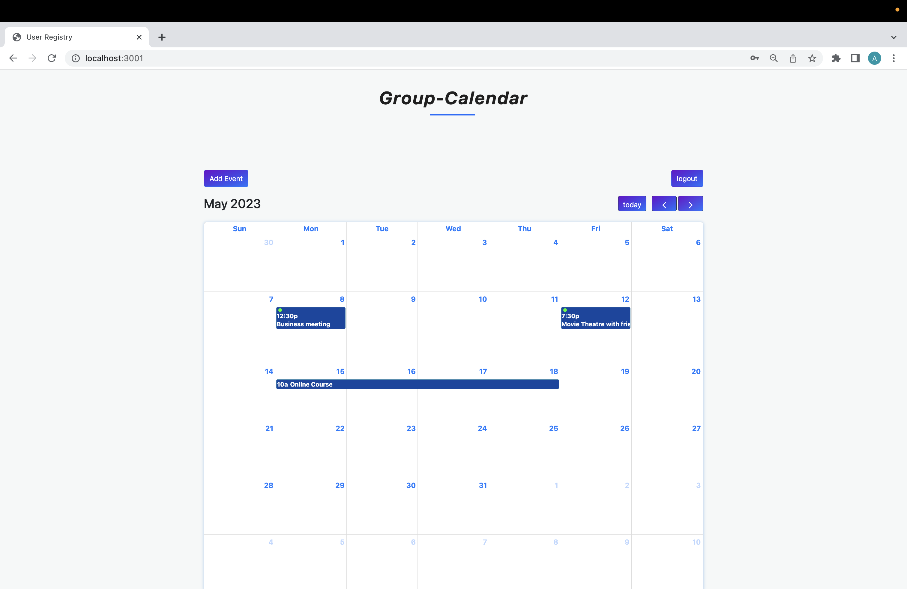

# Group-Calendar
This is a calendar app that allows you and your friends/work colleagues to arrange together your meetings & events

## User Story

```
AS A user
I WANT to have an application tht allow to me and my group to have access to it to arrange our meetings and events with the possibility for all of us to check our events calendar during the year, add event, or even delete it if it's necessary.
```

## Acceptance Criteria

```
GIVEN an events calendar dashboard with ability to view, add and delete events
WHEN I open the application
THEN I am presented with a log-in/sign-up form
WHEN I log-in as group member
THEN I am be able to see our events calendar
WHEN I sign-up as new group member
THEN I am be able to my group events calendar
WHEN I press Add event button
THEN I am presented with a form input to add event title, start and end event date and time
WHEN I press on the event
THEN I am presented with event details and delete button if we have to
WHEN I press delete button
THEN I delete the event and gone from our calendar
WHEN I log-in again
THEN I can see our events data again with no any issues
```

## Way to use it:
Sign-up and log-in with your group and add your events schedule so every group member can access to it, view and keep tracking for important events

## Collaborators

Click below to see more work from our collaborators!

[Jessie Gibbs](https://github.com/Karlfranzia)

[Jeffrey Yeh](https://github.com/ETFruitNinja)

[Bryan Buechler](https://github.com/Bryan-Codes)

[Alaa Kouki](https://github.com/alaakouki)

## Mock-up
 Group-Calendar App webpage URL:

[Live Link of Deployed Application](https://)

The following image demonstraites how Group-Calendar app looks once the user navigates to the live page, calendar events and event details




